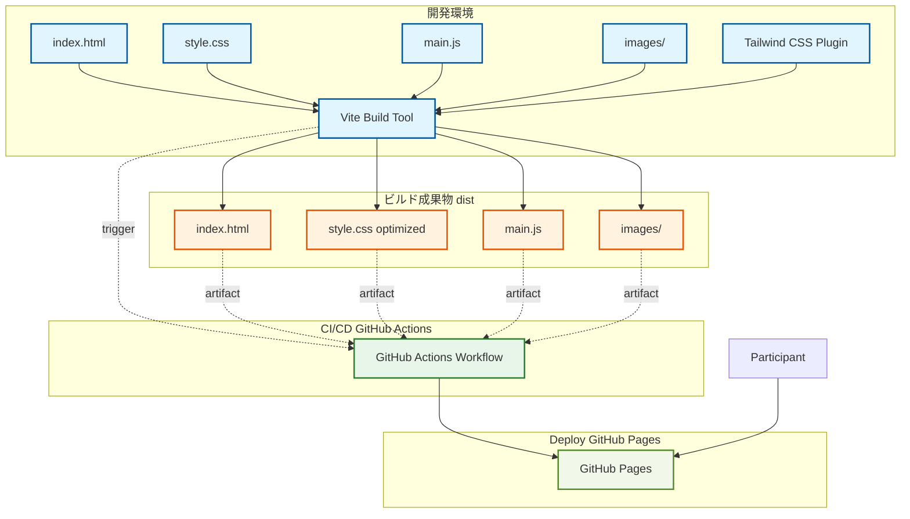
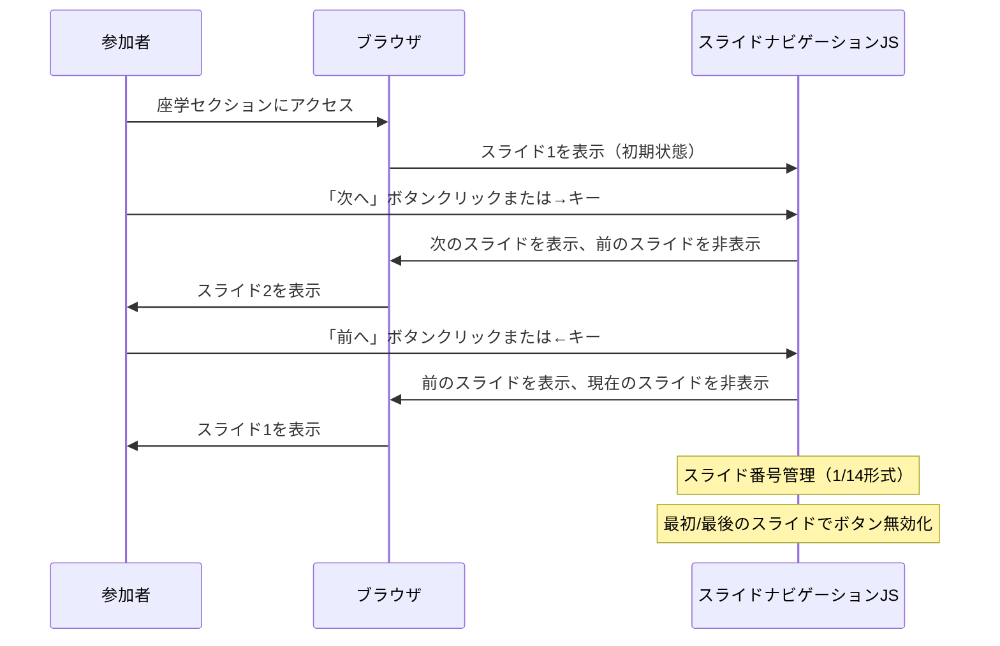

# Design Document

## Overview

本機能は、New Relic Service Level Managementのハンズオン参加者に対して、HTMLベースの包括的な学習ガイドを提供します。プロダクトオーナー、プロジェクトマネージャー、SRE、開発者が、ブラウザ上でService Level（SLI/SLO/SLA）の座学からデモECサイトを使用したSLO設計・管理の実技までを一貫して学習できる環境を構築します。

座学セクションはプレゼンテーション形式で提供され、ユーザー視点の重要性やSLOレベルごとの労力・コストのトレードオフを視覚的に理解できます。環境セットアップからSLO運用まで、段階的な手順とコマンド例を含む実践的なガイドにより、参加者は自己学習で90分のカリキュラムを完了できます。

**ユーザー**: ハンズオン参加者（プロダクトオーナー、PM、SRE、開発者）
**影響**: プロジェクトに新規`docs/`ディレクトリを追加し、静的HTMLガイドを配置します。既存のアプリケーション（バックエンド/フロントエンド）には変更を加えません。

### Goals
- 座学セクションをスライド形式で提供し、Service Level Managementの理論を視覚的に理解できるようにする
- GitHub Codespacesでの環境セットアップ手順を明確に示し、参加者が迅速に実技に移行できるようにする
- New Relic UIでのSLO設定・管理手順を具体的なコマンド例とともに提供する
- 単一HTMLファイル構成により、デプロイとオフライン利用を容易にする
- Tailwind CSSによる視覚的に読みやすいレイアウトを実現する

### Non-Goals
- モバイル/タブレット対応（PC専用）
- 印刷用レイアウト最適化
- トラブルシューティングセクション（別途提供）
- 参考資料リンク集（既存README.mdに含まれる）
- インタラクティブな演習機能（実際のデモECサイトで実施）
- 多言語対応（日本語のみ）
- S3/CloudFront等の商用ホスティング（GitHub Pages無料枠を使用）

## Architecture

### Existing Architecture Analysis
本機能は既存のSLMハンズオンプロジェクト（Go APIサーバー + Next.jsフロントエンド + Docker環境）に対するドキュメント追加です。既存のアプリケーションコードには変更を加えず、`docs/`ディレクトリを新規作成してHTMLガイドを配置します。

既存プロジェクト構成:
- `backend/` — Go APIサーバー（New Relic APM統合）
- `frontend/` — Next.jsフロントエンド（New Relic RUM統合）
- `scripts/` — Playwright負荷生成スクリプト
- `README.md` — プロジェクト説明とセットアップ手順

### Architecture Pattern & Boundary Map



**Architecture Integration**:
- Selected pattern: Viteビルドによる静的HTMLドキュメント生成
- Domain/feature boundaries: ドキュメント層として独立、既存アプリケーションとの結合なし
- Existing patterns preserved: プロジェクトルートのドキュメント配置パターン（README.mdと同様）
- New components rationale: Viteビルドにより最適化されたCSS/JSを生成、本番環境で高速表示
- Steering compliance: 既存プロジェクト構造を維持し、ドキュメントのみを追加
- **重要**: サーバーサイドレンダリング（SSR）は不使用。Viteは静的ファイル生成のみを担当し、GitHub Actionsで自動ビルド＆GitHub Pagesで配信

### Technology Stack

| Layer | Choice / Version | Role in Feature | Notes |
|-------|------------------|-----------------|-------|
| Build Tool | Vite 6.x | 開発サーバーとビルド最適化 | HMR対応、静的ファイル生成 |
| Frontend / UI | HTML5 + CSS3 + JavaScript (ES6) | ガイドの表示とナビゲーション | 完全な静的ファイル |
| CSS Framework | Tailwind CSS v4 + `@tailwindcss/vite` | スタイリング、未使用CSS削除 | ビルド時に最適化、要件8.2準拠 |
| Syntax Highlighting | Prism.js (npm package) | コードブロックのシンタックスハイライト | Bash, YAML対応、ビルドに含む |
| Hosting | GitHub Pages | 静的ファイル配信 | GitHub Actions自動デプロイ |
| CI/CD | GitHub Actions | ビルド＆デプロイ自動化 | mainブランチpush時に自動実行 |

## System Flows

座学セクションのスライドナビゲーション:



**Key Decisions**:
- JavaScriptによる動的なclass切り替え（hidden/block）でスライド表示制御
- キーボードイベント（ArrowLeft/ArrowRight）とボタンクリックの両方に対応
- URLハッシュ不使用（ページリロード時は常にスライド1から開始）

## Requirements Traceability

| Requirement | Summary | Components | Key Decisions |
|-------------|---------|------------|---------------|
| 1 | HTMLガイドの基本構造 | HTMLDocument, NavigationSystem | 単一HTMLファイル、目次アンカーリンク |
| 2 | 座学セクション（プレゼンテーション形式） | SlideSection, SlideNavigator | カスタムCSS実装、キーボードナビゲーション |
| 3 | 環境セットアップセクション | SetupSection | コマンド例、手順説明 |
| 4 | SLO設定・管理セクション | SLOSection | New Relic操作手順、環境変数調整例 |
| 5 | コードスニペットとコマンド表示 | CodeBlockComponent | Prism.js統合、コピーボタン |
| 6 | 視覚的な補助資料 | ImageComponent | 画像参照、alt属性 |
| 7 | ナビゲーションと進捗管理 | NavigationSystem, TimeIndicator | 前へ/次へボタン、推奨時間表示 |
| 8 | 技術スタックとブラウザ互換性 | - | Tailwind CSS CDN、モダンブラウザ対応 |

## Components and Interfaces

### Component Summary

| Component | Domain/Layer | Intent | Req Coverage | Key Dependencies | Contracts |
|-----------|--------------|--------|--------------|------------------|-----------|
| HTMLDocument | Presentation | メインHTMLファイル、全セクション統合 | 1, 2, 3, 4, 5, 6, 7, 8 | Tailwind CSS CDN (P0), Prism.js CDN (P1) | Structure |
| TableOfContents | Navigation | 目次セクション、アンカーリンク提供 | 1.3 | HTMLDocument (P0) | Navigation |
| SlideSection | Presentation | 座学スライド表示エリア | 2 | SlideNavigator (P0) | State |
| SlideNavigator | Logic | スライド切り替えロジック | 2.13 | SlideSection (P0) | Event |
| SetupSection | Presentation | 環境セットアップ手順表示 | 3 | CodeBlockComponent (P1) | Structure |
| SLOSection | Presentation | SLO設定・管理手順表示 | 4 | CodeBlockComponent (P1) | Structure |
| CodeBlockComponent | Presentation | コードブロック表示（シンタックスハイライト） | 5.1 | Prism.js (P0) | Rendering |
| ImageComponent | Presentation | 画像表示（alt属性） | 6 | - | Rendering |
| NavigationButtons | UI | 前へ/次へボタン | 2.13, 7.2 | - | Event |
| TimeIndicator | UI | 推奨時間表示 | 2.14, 3.7, 4.7, 7.1 | - | Display |

### Presentation Layer

#### HTMLDocument

| Field | Detail |
|-------|--------|
| Intent | ハンズオンガイド全体を統合する単一HTMLファイル |
| Requirements | 1, 2, 3, 4, 5, 6, 7, 8 |

**Responsibilities & Constraints**
- 全セクション（目次、座学、環境セットアップ、SLO設定）をDOM要素として保持
- Tailwind CSS v4 CDN、Prism.js CDNを`<head>`でロード
- セクションIDベースのアンカーリンクによるナビゲーション提供
- スムーススクロール動作（`scroll-behavior: smooth`）

**Dependencies**
- Build: Vite — ビルドツール、開発サーバー (P0)
- Build: Tailwind CSS v4 + `@tailwindcss/vite` — スタイリング、CSS最適化 (P0)
- Build: Prism.js (npm package) — シンタックスハイライト (P1)
- Outbound: 画像ファイル (`docs/images/`) — 視覚的補助資料 (P2)

**Contracts**: Structure [✓] / Event [ ]

##### Structure Interface
```html
<!DOCTYPE html>
<html lang="ja">
<head>
  <meta charset="UTF-8">
  <meta name="viewport" content="width=device-width, initial-scale=1.0">
  <title>New Relic SLM ハンズオンガイド</title>
  <link rel="stylesheet" href="/style.css">
</head>
<body class="bg-gray-50 text-gray-900">
  <!-- ヘッダー -->
  <header id="header">...</header>

  <!-- 目次 -->
  <nav id="toc">...</nav>

  <!-- 座学セクション -->
  <section id="lecture">...</section>

  <!-- 環境セットアップセクション -->
  <section id="setup">...</section>

  <!-- SLO設定・管理セクション -->
  <section id="slo-management">...</section>

  <!-- フッター -->
  <footer id="footer">...</footer>

  <script type="module" src="/main.js"></script>
</body>
</html>
```

**ビルド設定**:
- `docs/style.css`: Tailwind CSSインポート (`@import "tailwindcss";`)
- `docs/main.js`: Prism.js初期化、スライドナビゲーションロジック
- `docs/vite.config.js`: Vite設定（`base: '/slm-handson/'` でGitHub Pagesパス対応）
- ビルド後: `dist/index.html`, `dist/style.css` (最適化済み), `dist/main.js`

**GitHub Actions設定**:
- `.github/workflows/deploy.yml`: mainブランチpush時に自動ビルド＆デプロイ
- アーティファクト: `docs/dist/`をGitHub Pagesにアップロード
- デプロイURL: `https://nrug-sre.github.io/slm-handson/`

**Implementation Notes**
- Integration: `docs/`ディレクトリに開発用ソースを配置、`npm run build`で`dist/`に静的ファイル生成
- Validation: HTML5バリデーション、アクセシビリティ（alt属性、セマンティックHTML）
- Risks: ビルドプロセス失敗時は開発サーバー（`npm run dev`）で確認可能

#### SlideSection

| Field | Detail |
|-------|--------|
| Intent | 座学セクションのスライド表示エリア |
| Requirements | 2 |

**Responsibilities & Constraints**
- 14枚のスライド（AI時代のSLM、ユーザー視点、可用性vs機能、SLOレベル比較、SLA/SLI/SLO定義等）を個別`<div>`として保持
- 1つのスライドのみを表示し、他は`hidden`クラスで非表示
- スライド番号（例: 1/14）を表示

**Dependencies**
- Inbound: SlideNavigator — スライド切り替え制御 (P0)
- Outbound: Tailwind CSS — スタイリング (P0)

**Contracts**: State [✓]

##### State Management
- State model: `currentSlideIndex` (0-based integer), `totalSlides` (constant 14)
- Persistence: セッションストレージ不使用（リロード時は常にスライド1）
- Concurrency: 不要（単一ユーザー操作）

**Implementation Notes**
- Integration: `<section id="lecture">`内に配置、各スライドは`<div class="slide hidden">`
- Validation: スライド数の整合性確認（JavaScript初期化時）
- Risks: JavaScriptエラー時はすべてのスライドが表示される（CSS fallback）

#### SlideNavigator

| Field | Detail |
|-------|--------|
| Intent | スライド切り替えロジックとキーボードナビゲーション |
| Requirements | 2.13 |

**Responsibilities & Constraints**
- 「次へ」「前へ」ボタンクリックイベント処理
- キーボードイベント（ArrowLeft/ArrowRight）処理
- currentSlideIndexの更新とDOM操作（class切り替え）
- 最初/最後のスライドでボタン無効化

**Dependencies**
- Inbound: NavigationButtons — ボタンクリックイベント (P0)
- Outbound: SlideSection — スライド表示切り替え (P0)

**Contracts**: Event [✓]

##### Event Contract
- Published events: なし（DOM直接操作）
- Subscribed events:
  - `click` on `#nextSlideBtn`, `#prevSlideBtn`
  - `keydown` on `document` (ArrowLeft, ArrowRight)
- Ordering / delivery guarantees: イベントリスナーは同期実行、順序保証

**Implementation Notes**
- Integration: `<script>`タグ内でDOMContentLoaded後に初期化
- Validation: スライドインデックス範囲チェック（0 <= index < totalSlides）
- Risks: なし（シンプルなDOM操作のみ）

#### CodeBlockComponent

| Field | Detail |
|-------|--------|
| Intent | コードブロック表示（シンタックスハイライト、コピーボタン） |
| Requirements | 5.1, 5.3 |

**Responsibilities & Constraints**
- Bashコマンド、YAML設定のシンタックスハイライト表示
- コピーボタン提供（オプション）
- コメントまたは説明文を含む

**Dependencies**
- External: Prism.js — シンタックスハイライト (P0)
- External: Prism Copy to Clipboard プラグイン — コピーボタン (P2, オプション)

**Contracts**: Rendering [✓]

##### Rendering Interface
```html
<div class="code-block-wrapper">
  <p class="text-sm text-gray-600 mb-2">コマンドの説明</p>
  <pre class="language-bash"><code>docker compose up -d --build</code></pre>
</div>
```

**Implementation Notes**
- Integration: SetupSection, SLOSection内で使用
- Validation: Prism.jsが対応する言語のみ使用（bash, yaml）
- Risks: Prism.js CDNロード失敗時はプレーンテキスト表示

### Navigation Layer

#### TableOfContents

| Field | Detail |
|-------|--------|
| Intent | 目次セクション、各セクションへのアンカーリンク提供 |
| Requirements | 1.3 |

**Responsibilities & Constraints**
- セクション一覧（座学、環境セットアップ、SLO設定・管理）をリスト表示
- 各セクションのID（#lecture, #setup, #slo-management）へのアンカーリンク
- スムーススクロール動作

**Dependencies**
- Outbound: HTMLDocument セクションID — アンカーリンク先 (P0)

**Contracts**: Navigation [✓]

**Implementation Notes**
- Integration: `<nav id="toc">`として配置
- Validation: セクションIDの存在確認
- Risks: なし（HTMLアンカーの標準機能）

#### NavigationButtons

| Field | Detail |
|-------|--------|
| Intent | 前へ/次へナビゲーションボタン |
| Requirements | 2.13, 7.2 |

**Responsibilities & Constraints**
- スライドセクション用の「次へ」「前へ」ボタン
- セクション間の「次のセクションへ」ボタン
- ボタン無効化（最初/最後のスライド、最後のセクション）

**Dependencies**
- Outbound: SlideNavigator — クリックイベント送信 (P0)

**Contracts**: Event [✓]

**Implementation Notes**
- Integration: 各セクションの末尾に配置
- Validation: ボタンのaria-disabled属性管理
- Risks: なし

## Data Models

### Domain Model

本機能は静的HTMLドキュメントであり、データベースやAPIは不要です。表示するコンテンツは全てHTMLマークアップとして埋め込まれます。

**コンテンツエンティティ**:
- **Slide**: 座学セクションの各スライド（タイトル、本文、画像参照）
- **SetupStep**: 環境セットアップの各手順（説明、コマンド例）
- **SLOStep**: SLO設定・管理の各手順（説明、コマンド例、画像参照）

**データフロー**:
```
HTMLソースコード → ブラウザレンダリング → ユーザー閲覧
```

## Error Handling

### Error Strategy
静的HTMLガイド（Viteビルド成果物）であるため、サーバーサイドエラーは発生しません。すべてのCSS/JSはビルド時にバンドルされ、外部CDN依存がないため、ネットワークエラーは最小限です。

### Error Categories and Responses

**ビルド時エラー**:
- Viteビルド失敗 → GitHub Actions CIで検出、デプロイ前にブロック
- Tailwind CSS設定エラー → ビルド時にエラー出力、開発サーバー（`npm run dev`）で確認可能
- Prism.jsインポートエラー → ビルド時にエラー出力、シンタックスハイライトが無効化される

**ブラウザ互換性エラー**:
- 古いブラウザでのJavaScriptエラー → スライドナビゲーション無効、すべてのコンテンツが一度に表示される
- CSS Grid未対応ブラウザ → レイアウトが単純な縦積みに変更される（graceful degradation）

**JavaScriptエラー**:
- スライドナビゲーションエラー → すべてのスライドが一度に表示される（CSS fallback）
- イベントリスナー登録失敗 → キーボードナビゲーション無効、ボタンクリックのみ動作

**リソース読み込みエラー**:
- 画像ロード失敗 → alt属性のテキストが表示される（要件6.5）
- GitHub Pagesダウンタイム → ページ全体がアクセス不可（GitHub側の問題）

### Monitoring
- **ビルド監視**: GitHub Actions CIで自動的にビルドエラーを検出
- **デプロイ監視**: GitHub Actionsログでデプロイ成功/失敗を確認
- **アクセス監視**: GitHub Pagesの統計情報でアクセス数を確認可能（リポジトリInsights）
- **エラー追跡**: ブラウザ側のエラーは収集しない（静的サイトのため、クライアントエラー追跡は実装しない）

## Testing Strategy

### ビルドテスト
1. **Viteビルド成功確認**: `npm run build`が正常に完了し、`dist/`ディレクトリに成果物が生成されることを確認
2. **Tailwind CSS最適化確認**: ビルド後のCSS（`dist/style.css`）が最適化され、未使用クラスが削除されていることを確認
3. **アセットバンドル確認**: Prism.jsがJSバンドルに含まれ、シンタックスハイライトが動作することを確認

### 統合テスト（手動）
1. **Prism.js シンタックスハイライト確認**: Bashコードブロックが色付けされることを確認
2. **スライドナビゲーション確認**: 「次へ」「前へ」ボタンとキーボード操作（矢印キー）でスライド切り替え動作確認
3. **アンカーリンク確認**: 目次リンククリックで該当セクションへスムーススクロール
4. **レスポンシブ確認**: PCディスプレイサイズ（1920x1080, 1366x768）で適切に表示されることを確認
5. **画像表示確認**: 全画像が正しく読み込まれ、alt属性が設定されていることを確認

### E2E/ブラウザテスト
1. **Chrome最新版**: 全機能動作確認（要件8.1で複数ブラウザ互換性を要求しているが、実テストはChrome最新版のみで実施）

### パフォーマンス
1. **初期ロード時間**: Lighthouse測定でFirst Contentful Paint < 1.5秒（目標）
2. **スライド切り替え**: class切り替えのみのため、即座に動作（目標: 100ms以内）
3. **バンドルサイズ**: `dist/style.css` < 50KB、`dist/main.js` < 100KB（目標）

## Optional Sections

### Performance & Scalability

**パフォーマンス目標**:
- 初期ロード時間: 3秒以内（通常のネットワーク環境）
- スライド切り替え: 100ms以内（JavaScriptによるclass切り替え）
- ページサイズ: 100KB以内（HTML本体、画像は外部参照）

**最適化手法**:
- 画像は外部参照（インライン化しない）
- 不要なJavaScriptライブラリを含めない（Prism.js最小限の言語のみ）
- CDNキャッシュ活用（Tailwind CSS, Prism.jsはブラウザキャッシュ）

### Security Considerations

**セキュリティコントロール**:
- XSS対策: 静的HTMLのみ、ユーザー入力なし
- HTTPS強制: GitHub Pages等のホスティング環境でHTTPS配信
- CDN整合性検証: Subresource Integrity (SRI)ハッシュ追加（オプション）

**脅威モデル**:
- CDN改ざん: SRIハッシュで検証（実装推奨）
- 悪意のあるスクリプト挿入: 静的HTMLのため該当なし

## Supporting References

### 完全なHTML構造例

```html
<!DOCTYPE html>
<html lang="ja">
<head>
  <meta charset="UTF-8">
  <meta name="viewport" content="width=device-width, initial-scale=1.0">
  <title>New Relic SLM ハンズオンガイド</title>
  <script src="https://cdn.jsdelivr.net/npm/@tailwindcss/browser@4"></script>
  <link href="https://cdnjs.cloudflare.com/ajax/libs/prism/1.29.0/themes/prism-tomorrow.min.css" rel="stylesheet" />
  <style type="text/tailwindcss">
    @theme {
      --color-primary: #0d47a1;
      --color-secondary: #1976d2;
    }
    .slide {
      min-height: 600px;
    }
  </style>
  <style>
    html {
      scroll-behavior: smooth;
    }
  </style>
</head>
<body class="bg-gray-50 text-gray-900 font-sans">

  <!-- ヘッダー -->
  <header class="bg-primary text-white py-6">
    <div class="container mx-auto px-4">
      <h1 class="text-4xl font-bold">New Relic Service Level Management ハンズオン</h1>
      <p class="mt-2 text-lg">座学と実技で学ぶSLI/SLO設計・管理</p>
    </div>
  </header>

  <!-- 目次 -->
  <nav id="toc" class="container mx-auto px-4 py-8">
    <h2 class="text-2xl font-bold mb-4">目次</h2>
    <ul class="space-y-2">
      <li><a href="#lecture" class="text-secondary hover:underline">1. 座学: Service Level Management基礎 (20分)</a></li>
      <li><a href="#setup" class="text-secondary hover:underline">2. 環境セットアップ (30分)</a></li>
      <li><a href="#slo-management" class="text-secondary hover:underline">3. SLO設定・管理 (30分)</a></li>
    </ul>
  </nav>

  <!-- 座学セクション -->
  <section id="lecture" class="container mx-auto px-4 py-8 bg-white rounded shadow">
    <h2 class="text-3xl font-bold mb-4">座学: Service Level Management基礎</h2>
    <p class="text-sm text-gray-600 mb-6">推奨時間: 20分</p>

    <div id="slide-container" class="relative">
      <!-- スライド1 -->
      <div class="slide" data-slide="0">
        <h3 class="text-2xl font-bold mb-4">AI時代におけるService Level Management</h3>
        <p class="mb-4">...</p>
      </div>

      <!-- スライド2 -->
      <div class="slide hidden" data-slide="1">
        <h3 class="text-2xl font-bold mb-4">従来の組織内成果物の問題点</h3>
        <p class="mb-4">...</p>
      </div>

      <!-- ... 残り12スライド ... -->
    </div>

    <!-- スライドナビゲーション -->
    <div class="flex justify-between items-center mt-6">
      <button id="prevSlideBtn" class="px-4 py-2 bg-secondary text-white rounded disabled:opacity-50" disabled>
        ← 前へ
      </button>
      <span id="slideCounter" class="text-gray-600">1 / 14</span>
      <button id="nextSlideBtn" class="px-4 py-2 bg-secondary text-white rounded">
        次へ →
      </button>
    </div>
  </section>

  <!-- 環境セットアップセクション -->
  <section id="setup" class="container mx-auto px-4 py-8 mt-8 bg-white rounded shadow">
    <h2 class="text-3xl font-bold mb-4">環境セットアップ</h2>
    <p class="text-sm text-gray-600 mb-6">推奨時間: 30分</p>

    <h3 class="text-2xl font-bold mb-3">1. GitHub Codespacesの起動</h3>
    <p class="mb-4">...</p>

    <div class="code-block-wrapper mb-6">
      <p class="text-sm text-gray-600 mb-2">リポジトリをクローン（ローカル環境の場合）</p>
      <pre class="language-bash"><code>git clone https://github.com/NRUG-SRE/slm-handson.git
cd slm-handson
cp .env.example .env</code></pre>
    </div>

    <!-- ... 残りのセットアップ手順 ... -->
  </section>

  <!-- SLO設定・管理セクション -->
  <section id="slo-management" class="container mx-auto px-4 py-8 mt-8 bg-white rounded shadow">
    <h2 class="text-3xl font-bold mb-4">SLO設定・管理</h2>
    <p class="text-sm text-gray-600 mb-6">推奨時間: 30分</p>

    <!-- ... SLO設定手順 ... -->
  </section>

  <!-- フッター -->
  <footer class="bg-gray-800 text-white py-6 mt-12">
    <div class="container mx-auto px-4 text-center">
      <p>&copy; 2025 New Relic SLM ハンズオン</p>
    </div>
  </footer>

  <!-- Prism.js -->
  <script src="https://cdnjs.cloudflare.com/ajax/libs/prism/1.29.0/prism.min.js"></script>
  <script src="https://cdnjs.cloudflare.com/ajax/libs/prism/1.29.0/components/prism-bash.min.js"></script>
  <script src="https://cdnjs.cloudflare.com/ajax/libs/prism/1.29.0/components/prism-yaml.min.js"></script>

  <!-- スライドナビゲーション -->
  <script>
    document.addEventListener('DOMContentLoaded', function() {
      const slides = document.querySelectorAll('.slide');
      const prevBtn = document.getElementById('prevSlideBtn');
      const nextBtn = document.getElementById('nextSlideBtn');
      const counter = document.getElementById('slideCounter');
      let currentSlide = 0;
      const totalSlides = slides.length;

      function showSlide(index) {
        slides.forEach((slide, i) => {
          slide.classList.toggle('hidden', i !== index);
        });
        counter.textContent = `${index + 1} / ${totalSlides}`;
        prevBtn.disabled = index === 0;
        nextBtn.disabled = index === totalSlides - 1;
      }

      prevBtn.addEventListener('click', () => {
        if (currentSlide > 0) {
          currentSlide--;
          showSlide(currentSlide);
        }
      });

      nextBtn.addEventListener('click', () => {
        if (currentSlide < totalSlides - 1) {
          currentSlide++;
          showSlide(currentSlide);
        }
      });

      document.addEventListener('keydown', (e) => {
        if (e.key === 'ArrowLeft' && currentSlide > 0) {
          currentSlide--;
          showSlide(currentSlide);
        } else if (e.key === 'ArrowRight' && currentSlide < totalSlides - 1) {
          currentSlide++;
          showSlide(currentSlide);
        }
      });

      showSlide(currentSlide);
    });
  </script>
</body>
</html>
```

### SLOレベル比較表データ

| SLOレベル | 月間ダウンタイム許容 | 年間ダウンタイム許容 | 必要な労力・コスト |
|----------|------------------|------------------|----------------|
| 90% | 3日 | 36.5日 | 低 |
| 99% | 7時間12分 | 3.65日 | 中 |
| 99.9% | 43分12秒 | 8.76時間 | 高 |
| 99.99% | 4分19秒 | 52.56分 | 非常に高 |
| 99.999% | 26秒 | 5.26分 | 極めて高 |

**9を一つ追加するごとの労力増加**:
- インフラコスト: 冗長化、マルチリージョン構成
- 運用コスト: オンコール体制、監視強化
- 開発コスト: テスト厳格化、デプロイ自動化
- 機会コスト: 新機能開発の優先度低下
