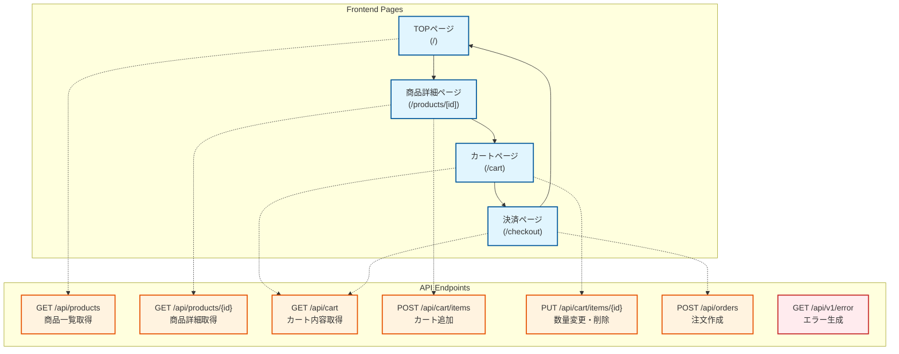
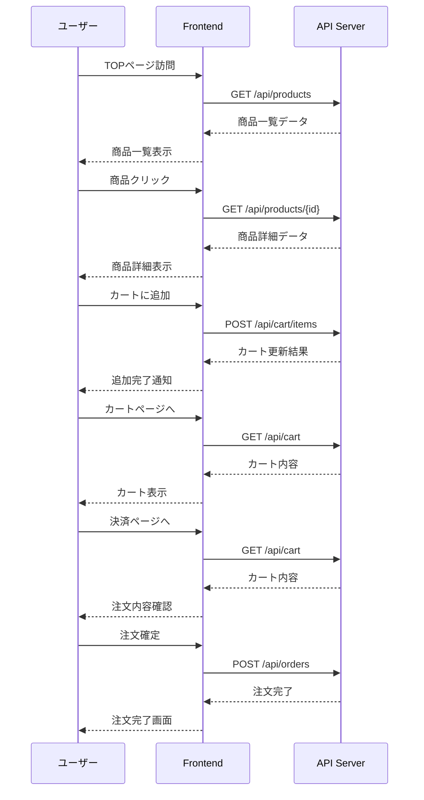

# New Relic Service Level Management ハンズオン

このプロジェクトは、New RelicのService Level Management（SLM）を活用してService Level Objective（SLO）やService Level Indicator（SLI）を管理するハンズオンを提供します。

## 概要

ECサイトをモデルとしたサンプルアプリケーション（Go APIサーバー + Next.jsフロントエンド）を使用して、New Relic APMとReal User Monitoring (RUM)によるエンドツーエンドのモニタリングとSLM機能の実践的な学習ができます。Docker Composeを使用して簡単に環境を構築し、**Playwrightベースの自動ユーザージャーニー負荷生成**により継続的にリアルなブラウザ操作でテレメトリーデータをNew Relicに送信しながら、**RUMとAPMの完全統合**によるSLO/SLIの設定と管理を体験できます。

## 前提条件

- **GitHub Codespaces** または **ローカル環境（Docker / Docker Compose）**
- New Relicアカウント
- New Relic License Key（APM用）
- New Relic Browser License Key（RUM用）

## セットアップ

### GitHub Codespacesを使用する場合（推奨）

GitHub Codespacesを使用すると、ブラウザだけで完全なハンズオン環境を構築できます。

**Codespacesの起動手順:**

1. このリポジトリのGitHubページ（https://github.com/NRUG-SRE/slm-handson）にアクセス
2. 画面右上の緑色ボタン **Code** をクリック
3. **Codespaces** タブを選択
4. **Create codespace on main** をクリック

数分後、ブラウザ内でVS Codeが起動し、プロジェクトが自動的に開きます。`.env`ファイルが自動生成されるので、次のステップ「環境変数の設定」に進んでください。

### ローカル環境を使用する場合

**前提条件:**
- Docker および Docker Compose
- Go 1.21以上（ローカル開発時）
- Node.js 18以上（ローカル開発時）

**リポジトリのクローン:**

```bash
git clone https://github.com/NRUG-SRE/slm-handson.git
cd slm-handson
cp .env.example .env
```

### 共通: 環境変数の設定

`.env`ファイルを編集して、New Relicのライセンスキーを設定します：
```
# Backend (APM)
NEW_RELIC_API_KEY=your-license-key-here
NEW_RELIC_APP_NAME=slm-handson-api
ERROR_RATE=0.0
RESPONSE_TIME_MIN=50
RESPONSE_TIME_MAX=500
SLOW_ENDPOINT_RATE=0.0

# Frontend (RUM)
NEXT_PUBLIC_NEW_RELIC_BROWSER_KEY=your-browser-license-key-here
NEXT_PUBLIC_NEW_RELIC_ACCOUNT_ID=your-account-id
NEXT_PUBLIC_NEW_RELIC_APPLICATION_ID=your-app-id  # 必須

# Load Generator (ユーザージャーニー負荷生成)
TARGET_URL=http://frontend:3000
ACCESS_INTERVAL=10
DURATION=3600
```

#### New Relic設定値の取得方法

**APM用ライセンスキー (`NEW_RELIC_API_KEY`)**:
1. New Relic UI → 左下のユーザーメニュー → **API keys**
2. **License keys** セクションで`Copy key ID`を選択して貼り付け

**RUM用設定 (`NEXT_PUBLIC_NEW_RELIC_BROWSER_KEY`, `NEXT_PUBLIC_NEW_RELIC_ACCOUNT_ID`, `NEXT_PUBLIC_NEW_RELIC_APPLICATION_ID`)**:
1. New Relic UI → **Browser** → **Add your first browser app** → **Browser monitoring** → **Place a JavaScript snippet in frontend code** を選択
2. アプリ名を入力（例：`slm-handson-frontend`）して **Save and continue**
3. **Configure the browser agent** では、そのまま **Save and continue**
4. 生成されたJavaScriptスニペットから以下を抽出：
   - `licenseKey`: `NEXT_PUBLIC_NEW_RELIC_BROWSER_KEY`
   - `accountID`: `NEXT_PUBLIC_NEW_RELIC_ACCOUNT_ID`  
   - `applicationID`: `NEXT_PUBLIC_NEW_RELIC_APPLICATION_ID`

例：
```javascript
// スニペットから抽出
NREUM.loader_config={
  accountID:"9999999",           // ← これをコピー
  applicationID:"111111111",    // ← これをコピー
  licenseKey:"NRBR-*****"    // ← これをコピー
}
```

### 共通: アプリケーションの起動

Docker Composeを使用してサンプルアプリケーションを起動します：

```bash
docker compose up -d --build
```

**アクセス方法:**

- **GitHub Codespaces**: VS Codeの「PORTS」タブで、3000番と8080番ポートの地球儀アイコンをクリック
- **ローカル環境**: 以下のURLにブラウザでアクセス
  - **フロントエンド**: http://localhost:3000
  - **バックエンドAPI**: http://localhost:8080/api
  - **ヘルスチェック**: http://localhost:8080/health
  - **API仕様書 (Swagger UI)**: http://localhost:8080/api/docs

## アーキテクチャ

### システム構成

```
┌─────────────┐     ┌─────────────┐     ┌─────────────┐
│   Browser   │────▶│  Frontend   │────▶│ API Server  │
│             │     │  (Next.js)  │     │    (Go)     │
└─────────────┘     └─────────────┘     └─────────────┘
      │                    │                    │
      │                    │                    │
      ▼                    ▼                    ▼
┌─────────────────────────────────────────────────────┐
│              New Relic Platform                     │
│  ┌─────────┐  ┌──────────────┐  ┌──────────────┐    │
│  │   RUM   │  │     APM      │  │     SLM      │    │
│  └─────────┘  └──────────────┘  └──────────────┘    │
└─────────────────────────────────────────────────────┘
```

### 画面とAPI構成図



### ユーザーフローとAPI呼び出しシーケンス



### コンポーネント

- **フロントエンド (Next.js)**
  - ECサイトのUI実装
  - Real User Monitoring (RUM) でクライアントサイドパフォーマンスを監視
  
- **APIサーバー (Go)**
  - クリーンアーキテクチャに基づく実装
  - 商品管理、カート、注文処理のREST API
  - New Relic APMでサーバーサイドパフォーマンスを監視

- **ユーザージャーニー負荷生成スクリプト（Playwright版）**
  - JavaScript + Playwrightによる完全なECサイトユーザージャーニー自動実行
  - リアルなブラウザ環境でのユーザー行動シミュレーション（思考時間、ランダム選択、実際のページ遷移）
  - 継続的なSLI/SLOデータ生成とNew Relic RUM/APM完全統合（セッション追跡、Distributed Tracing）

## ハンズオンシナリオ

### 1. 環境セットアップ（20分）
- **GitHub Codespacesの起動**（ローカル環境の場合はリポジトリクローン）
- **New Relic License Keyの払い出しと設定**
  - `.env`ファイルの編集でライセンスキーを設定
- **デモアプリケーションの起動と動作確認**
  - `docker compose up -d --build`で起動
- **フロントエンドでECサイトの動作確認**
  - Codespaces: PORTSタブから3000番ポートを開く
  - ローカル: http://localhost:3000 にアクセス
- **Swagger UIでAPI仕様の確認**
  - Codespaces: PORTSタブから8080番ポート `/api/docs` にアクセス
  - ローカル: http://localhost:8080/api/docs にアクセス
- **APM / Real User Monitoringの計測確認**
  - New Relic UIでデータ受信を確認

### 2. SLM設定ハンズオン（40分）
- **ユーザージャーニーの設定**
  - ECサイトで最も重要な機能の特定
  - 購入完了までのジャーニー設定
  
- **SLIの設定**
  - 可用性SLI（成功率ベース）
  - パフォーマンスSLI（レスポンスタイムベース）
  
- **SLOの設定**
  - 99.99% vs 99.9%の違いと影響
  - 適切な目標値の設定

### 3. SLO管理ハンズオン（30分）
- **自動ユーザージャーニー実行（Playwright版・推奨）**
  ```bash
  # 2段階起動でネットワークエラー回避
  docker compose up -d
  docker compose --profile playwright up playwright-generator
  
  # 短時間テスト（1分間、5秒間隔）
  DURATION=60 ACCESS_INTERVAL=5 docker compose --profile playwright up playwright-generator
  ```
- **RUM/APM統合データ確認**: フロントエンドとバックエンドの完全なトレース統合
- **環境変数によるService Level変化の体験**（ERROR_RATE調整）
- **エラーバジェット運用体験**: バジェット消費とアラート確認
- **New Relic UIでのSLO違反確認**: リアルタイムSLI/SLO監視と統合ダッシュボード活用

## 主要なAPIエンドポイント

### 商品関連
- `GET /api/products` - 商品一覧
- `GET /api/products/{id}` - 商品詳細

### カート機能
- `GET /api/cart` - カート内容取得
- `POST /api/cart/items` - 商品をカートに追加
- `PUT /api/cart/items/{id}` - カート内商品の数量変更・削除

### 注文・決済
- `GET /api/orders` - 全注文一覧取得（管理者用・ハンズオン確認用）
- `POST /api/orders` - 注文作成（決済処理含む）

### SLMデモ用
- `GET /api/v1/error` - エラー生成エンドポイント（ERROR_RATE環境変数で制御）

### API仕様書
- `GET /api/docs` - Swagger UI（ブラウザでAPIドキュメント閲覧）
- `GET /api/docs/swagger.yaml` - OpenAPI 3.0.3仕様書（YAML形式）

## ユーザージャーニー負荷生成

### 自動ユーザージャーニー実行（Playwright版・推奨）

**New Relic RUM/APM完全統合** - リアルなブラウザ環境での完全なECサイトユーザー行動シミュレーション：

```bash
# 推奨: 2段階起動でネットワークエラー回避
docker compose up -d
docker compose --profile playwright up playwright-generator

# 短時間テスト（1分間、5秒間隔）
DURATION=60 ACCESS_INTERVAL=5 docker compose --profile playwright up playwright-generator

# バックグラウンド実行（ログなし）
docker compose up -d
docker compose --profile playwright up -d playwright-generator
```

**実行されるユーザージャーニー**（RUM/APM統合データ生成）:
1. **TOPページ訪問** → ページ表示 + GET /api/products（RUMページビュー + APMトランザクション）
2. **商品詳細表示** → 実際のページ遷移 + GET /api/products/{id}（ランダム選択）
3. **カート追加** → ボタンクリック + POST /api/cart/items（1-3個ランダム）
4. **カート確認** → ページ遷移 + GET /api/cart
5. **決済ページ** → ページ遷移 + GET /api/cart（注文内容確認）
6. **注文完了** → フォーム送信 + POST /api/orders

### 従来のGo版負荷生成器（オプション）

API呼び出しのみ（RUMデータなし）:

```bash
# API負荷のみ生成
docker compose --profile load-test up load-generator
```

### パフォーマンス劣化シミュレーション

環境変数を変更してSLO違反を体験：

```bash
# エラー率を30%に設定
export ERROR_RATE=0.3
export RESPONSE_TIME_MAX=2000
docker compose up -d --build api-server

# 正常な状態に戻す
export ERROR_RATE=0.0
export SLOW_ENDPOINT_RATE=0.0
docker compose up -d --build api-server
```

### 手動APIテスト

APIクライアントでの個別テスト：

```bash
# 商品一覧を取得
curl http://localhost:8080/api/products

# エラー生成エンドポイントでSLO違反をシミュレート
curl http://localhost:8080/api/v1/error
```

## 開発コマンド

```bash
# ログの確認
docker compose logs -f
docker compose logs -f api-server
docker compose logs -f frontend

# アプリケーションの停止
docker compose down

# ビルドして起動
docker compose up -d --build

# 個別サービスの再起動
docker compose restart api-server
docker compose restart frontend
```

## プロジェクト構成

```
slm-handson/
├── backend/          # Go APIサーバー
├── frontend/         # Next.jsフロントエンド
├── scripts/          # ユーザージャーニー負荷生成スクリプト
├── swagger.yaml      # OpenAPI 3.0.3仕様書
├── docker compose.yml # Docker構成
├── .env.example      # 環境変数サンプル
└── README.md         # プロジェクト説明
```

## 主要機能

### フロントエンド機能
- **TOPページ**: 商品一覧表示、NRUG-SREブランディング
- **商品詳細ページ**: 商品詳細表示、数量選択、カート追加機能
- **カートページ**: カート管理、数量変更・削除機能、合計金額表示
- **決済ページ**: 注文内容サマリー、注文確定フロー、注文完了画面

### APIサーバー機能
- **REST API**: 商品、カート、注文の全エンドポイント
- **Swagger UI**: API仕様書の閲覧（http://localhost:8080/api/docs）
- **New Relic APM**: サーバーサイドパフォーマンス監視

### 監視・負荷生成機能
- **New Relic RUM**: クライアントサイドパフォーマンス監視（ページビュー、Ajax、エラー、Core Web Vitals）
- **New Relic APM**: サーバーサイドパフォーマンス監視（トランザクション、データベース、外部API）
- **RUM/APM完全統合**: セッション追跡、Distributed Tracing、カスタム属性による統合ダッシュボード
- **Playwrightユーザージャーニー負荷生成**: 完全なECサイトフロー自動実行（ブラウザベース）
- **リアルタイムSLI/SLOデータ生成**: 継続的な監視データ提供とエンドツーエンド可視性

## 🔗 New Relic RUM/APM完全統合機能

**2025年8月実装完了** - フロントエンドとバックエンドの完全なトレース統合により、真のエンドツーエンド監視を実現：

### ✅ 統合機能詳細

1. **セッション統一追跡**
   - 一意のセッションID（`session_{timestamp}_{random}`）により、ブラウザとAPIサーバー間の完全な追跡
   - New Relic UI で同一セッションのフロントエンド操作とバックエンド処理を関連付けて分析

2. **Distributed Tracing**
   - フロントエンド Ajax リクエストからバックエンド API トランザクションまでの完全なトレース
   - リクエストフローの可視化とボトルネック特定

3. **統合ダッシュボード活用**
   ```sql
   -- セッション別パフォーマンス分析
   SELECT session.id, average(duration) 
   FROM PageView, Transaction 
   WHERE session.id IS NOT NULL 
   GROUP BY session.id
   
   -- エンドツーエンドエラー率監視
   SELECT percentage(count(*), WHERE error IS true) 
   FROM PageView, Transaction 
   WHERE session.id IS NOT NULL
   ```

### 🎯 ハンズオンでの体験価値

- **完全なSLO設定**: フロントエンドUXとバックエンドAPIの統合SLO設定
- **リアルタイム監視**: Playwright負荷生成により、実際のユーザー行動に近い監視データを生成
- **統合パフォーマンス分析**: ブラウザ側とサーバー側の両方からのボトルネック特定
- **エラー根本原因分析**: フロントエンドエラーと対応するAPI呼び出しの関連分析

## トラブルシューティング

### よくある問題と対処法

**1. ポート競合エラー**
- **症状**: `port is already allocated`
- **対処**: 3000番（フロントエンド）、8080番（API）が使用されていないか確認
```bash
sudo lsof -i :3000
sudo lsof -i :8080
```

**2. New Relicにデータが表示されない**
- **症状**: APMやRUMでデータが送信されない
- **対処**:
  1. `.env`ファイルでLicense Keyが正しく設定されているか確認
  2. `NEXT_PUBLIC_NEW_RELIC_APPLICATION_ID`が設定されているか確認（必須）
  3. アプリケーション名が正しいか確認
  4. 数分待ってからNew Relic UIをリフレッシュ
  5. ブラウザコンソールでエラーメッセージを確認

**3. RUM 400 Bad Requestエラー**
- **症状**: ブラウザコンソールに`bam.nr-data.net`への400エラー
- **対処**: `NEXT_PUBLIC_NEW_RELIC_APPLICATION_ID`が正しい数値で設定されているか確認

**4. 環境変数が反映されない**
- **症状**: Docker内で環境変数が読み込まれない
- **対処**: 
```bash
# コンテナを完全に再ビルド
docker compose down
docker compose up -d --build
```

**5. Playwright負荷生成器のネットワークエラー**
- **症状**: `network not found` エラー
- **対処**: 2段階起動を使用
```bash
# 基本サービスを先に起動
docker compose up -d
# Playwrightサービスを起動
docker compose --profile playwright up playwright-generator
```

**6. Docker関連のエラー**
- **対処**: ログでエラーメッセージを確認
```bash
docker compose logs -f
docker compose logs api-server
docker compose logs frontend
docker compose logs playwright-generator
```

## 参考資料

- [New Relic Service Level Management](https://docs.newrelic.com/docs/service-level-management/)
- [SLI/SLO設計のベストプラクティス](https://sre.google/sre-book/service-level-objectives/)
- [Error Budgetの運用方法](https://sre.google/workbook/error-budget-policy/)

## 貢献

イシューやプルリクエストは歓迎します。大きな変更を行う場合は、まずイシューを作成して変更内容について議論してください。

## ライセンス

このプロジェクトはMITライセンスの下で公開されています。